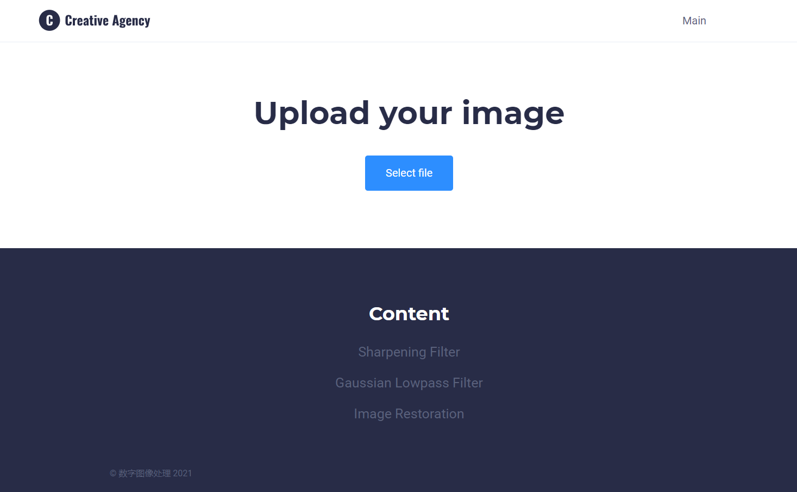
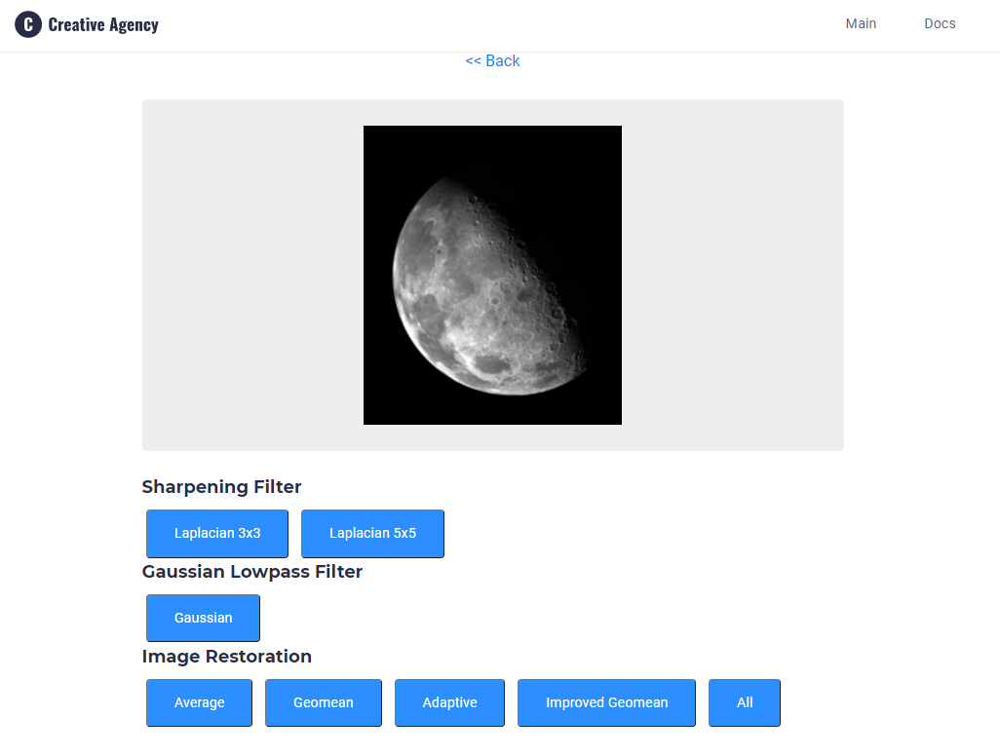

# 程序说明

## 1. 安装
本程序架构是基于Python开发的前端-算法-代码生成结构。安装仅需要Python依赖。在开发和测试中使用的Python是Python 3.6.9，操作系统是Windows 10。建议使用的评分Python也是Python 3.6.x，其余Python环境不保证复现同样的结果。操作系统变换的影响并未在本项目中评估，如果运行发生故障，请联系[zhengsz@pku.edu.cn](zhengsz@pku.edu.cn)。以下命令假设在一个新的Python虚拟环境，pip和python都指向了正确的虚拟环境pip和python。

安装命令如下：
```sh
cd <the-root-dir-of-this-project>
pip install -r requirements.txt
```

## 2. 运行
本程序的前端接口与课程助教提供的基础版本一致，仅做必要的功能性改变。使用方式为：
```sh
python app.py
```
运行后期望的控制台状态是
```sh
 * Serving Flask app "app" (lazy loading)
 * Environment: production
   WARNING: This is a development server. Do not use it in a production deployment.
   Use a production WSGI server instead.
 * Debug mode: on
 * Running on http://127.0.0.1:5000/ (Press CTRL+C to quit)
 * Restarting with stat
 * Debugger is active!
 * Debugger PIN: 140-204-495
```
依照提示，在同一机器的浏览器中访问[http://127.0.0.1:5000/](http://127.0.0.1:5000/)，期望的界面是
。
通过点击`Select file`选择图片。依照项目要求自行寻找至少20张图片，分别放在了`images/problem2`, `images/problem5`, `images/problem6`。正如文件目录名字所示，在该项目中我选择的题目是第2小题，第5小题，第6小题。
如果希望测试第2小题，选择`images/problem2`下的图片，如：
。第2小题的内容是空间域锐化滤波器，并指定选择拉普拉斯变换，所以实现中尝试两种filter大小，体现在Sharpening Filter下的两个按钮上，点击对应的按钮即可观察变换结果。
第5小题和第6小题也是可以同样的方法观察。第5小题是频率域高斯低通滤波，使用不同的滤波器半径。第6题是空间域滤波复原，实现算数均值滤波，几何均值滤波，自适应滤波器。其中几何均值滤波实现了两个版本，普通版本是完全按照书中介绍算法计算，提升版本则是有所改变。点击`All`时展示的几何均值结果是提升后的。